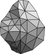

# graphite - A Haskell graphs and networks library

Represent, analyze and visualize graphs & networks.

## Documentation

* Tutorial (under construction): http://haskell-graphite.readthedocs.io/
* Haddock: https://hackage.haskell.org/package/graphite#modules

## TODO

List of currently `undefined` functions that should be implemented eventually.
Pull requests are very welcome.

- `toAdjacencyMatrix`     (Data.Graph.UGraph)
- `toAdjacencyMatrix`     (Data.Graph.DGraph)
- `isSymmetric`           (Data.Graph.DGraph)
- `isOriented`            (Data.Graph.DGraph)
- `isRegular`             (Data.Graph.DGraph)
- `isDirectedGraphic`     (Data.Graph.UGraph.DegreeSequence)
- `fromGraphicalSequence` (Data.Graph.UGraph.DegreeSequence)
- `areIsomorphic`         (Data.Graph.Morphisms)
- `isomorphism`           (Data.Graph.Morphisms)
- `isURegular`            (Data.Graph.Morphisms)
- `isDRegular`            (Data.Graph.Morphisms)

## Known bugs

### <= 0.10.0.1

- `insertEdgeTriple` does not update the attribute in DGraph [#2](https://github.com/alx741/graphite/issues/2)
