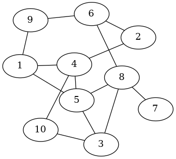
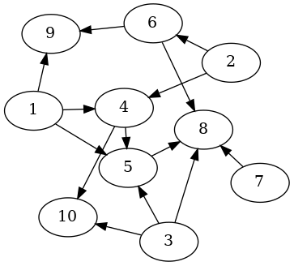
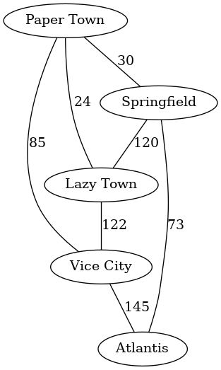
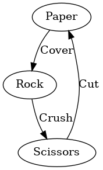
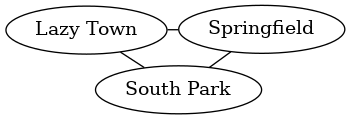

# Basic Graphs

Graphite provides two types for graphs: `UGraph` for undirected graphs and
`DGraph` for directed graphs.

Lets represent some graphs.

## Undirected graphs



```haskell
myGraph :: UGraph Int ()
myGraph = fromEdgesList
    [ 1 <-> 4
    , 1 <-> 5
    , 1 <-> 9
    , 2 <-> 4
    , 2 <-> 6
    , 3 <-> 5
    , 3 <-> 8
    , 3 <-> 10
    , 4 <-> 5
    , 4 <-> 10
    , 5 <-> 8
    , 6 <-> 8
    , 6 <-> 9
    , 7 <-> 8
    ]
```

The type `UGraph Int ()` here means that this is an undirected graph `UGraph`,
with vertices of type `Int` and edges with attributes of type `()`.

The `<->` operator constructs an *Undirected* `Edge` between to vertices.

The `fromEdgesList` function constructs an `UGraph` from a list of `Edge`s.


## Directed Graphs



```haskell
myGraph :: DGraph Int ()
myGraph = fromArcsList
    [ 1 --> 4
    , 1 --> 5
    , 1 --> 9
    , 2 --> 4
    , 2 --> 6
    , 3 --> 5
    , 3 --> 8
    , 3 --> 10
    , 4 --> 5
    , 4 --> 10
    , 5 --> 8
    , 6 --> 8
    , 6 --> 9
    , 7 --> 8
    ]
```

The type `DGraph Int ()` here means that this is a directed graph `DGraph`,
with vertices of type `Int` and edges with attributes of type `()`.

The `-->` operator constructs a *Directed* `Arc` between to vertices.

The `fromArcsList` function constructs a `DGraph` from a list of `Arc`s.


## Other vertex types

Graphite can use any `Hashable` type as the vertices of a graph, this way we
could have a graph of `Int`s, `Float`s, `Bool`s, `Char`s, `String`s,
`ByteString`s, `Text` and more.

Take for instance this undirected graph with `Float` vertices (parenthesis for
clarity):

```haskell
myGraph :: UGraph Float ()
myGraph = fromEdgesList [(1.3 <-> 2.5), (3.4 <-> 6.8), (2.5 <-> 4.4)]
```

Or this directed graph with `String` vertices:

```haskell
myGraph :: DGraph String ()
myGraph = fromArcsList ["Paper" --> "Rock", "Rock" --> "Scissors", "Scissors" -> "Paper"]
```

## Edges with attributes

By using the `<->` and `-->` constructors, the resulting `Edge`s and `Arc`s have
attributes of type `()`. If we need edges with some attributes like weights or
labels for example, we could use the `Edge` and `Arc` data constructors
directly.

Lets build a graph of cities and the distances in kilometers between them:



```haskell
cities :: UGraph String Int
cities = fromEdgesList
    [ Edge "Paper Town" "Springfield" 30
    , Edge "Springfield" "Lazy Town" 120
    , Edge "Paper Town" "Vice City" 85
    , Edge "Vice City" "Atlantis" 145
    , Edge "Atlantis" "Springfield" 73
    , Edge "Lazy Town" "Vice City" 122
    , Edge "Lazy Town" "Paper Town" 24
    ]
```

If the roads between those cities are one way only, we should use *Arcs* instead
of *Edges* and form a directed graph like so:

```haskell
cities :: DGraph String Int
cities = fromArcsList
    [ Arc "Paper Town" "Springfield" 30
    , Arc "Springfield" "Lazy Town" 120
    , Arc "Paper Town" "Vice City" 85
    , Arc "Vice City" "Atlantis" 145
    , Arc "Atlantis" "Springfield" 73
    , Arc "Lazy Town" "Vice City" 122
    , Arc "Lazy Town" "Paper Town" 24
    ]
```


The edge's attributes can be of any type, so we could for instance label them
by using `String`:



```haskell
myGraph :: DGraph String String
myGraph = fromArcsList
    [ Arc "Paper" "Rock" "Cover"
    , Arc "Rock" "Scissors" "Crush"
    , Arc "Scissors" "Paper" "Cut"
    ]
```


# Complex graphs - complex vertices, complex edges

Remember that graphite can use any `Hashable` data type as vertices, so we could
define our own data types, make them instances of `Hashable` and use it as
vertices.

Edge attributes on the other hand have no restriction and can be of any type.
Though some functions will require the attributes to be `Weighted` or `Labeled`
(type classes defined in Data.Graph.Types) if the nature of the algorithm
requires it (like when computing shortest paths).

Lets try this out. First define some data types:

```haskell
{-# LANGUAGE DeriveGeneric #-}

import GHC.Generics (Generic)
import Data.Hashable

-- Data type for vertices
data Element
    = Paper
    | Rock
    | Scissors
    deriving (Show, Ord, Eq, Generic)

instance Hashable Element


-- Data type for edge attributes
data Action
    = Cover
    | Crush
    | Cut
    deriving (Show, Ord, Eq)
```

Although we could define `Hashable` instances manually, here we go for the
automatic generation of default instances.

Now define a graph with vertices of type *Element* and edge attributes of type
*Action*:

```haskell
myGraph :: DGraph Element Action
myGraph = fromArcsList
    [ Arc Paper     Rock        Cover
    , Arc Rock      Scissors    Crush
    , Arc Scissors  Paper       Cut
    ]
```


## Record vertices

By using the same approach it's possible to define data types with record syntax
like so:

```haskell
{-# LANGUAGE DeriveGeneric #-}

import GHC.Generics (Generic)
import Data.Hashable

data City = City
    { name :: String
    , major :: String
    , population :: Int
    } deriving (Show, Ord, Eq, Generic)

instance Hashable City
```

Write a couple instances:

```haskell
lazyTown, springfield, southPark :: City

lazyTown = City "Lazy Town" "Milford Meanswell" 12
springfield = City "Springfield" "Joe Quimby" 30720
southPark = City "South Park, Colorado" "McDaniels" 2540
```

And finally use them in a graph:

```haskell
cities :: UGraph City ()
cities = fromEdgesList
    [ lazyTown <-> springfield
    , springfield <-> southPark
    , southPark <-> lazyTown
    ]
```




# Working with graph-type independence
