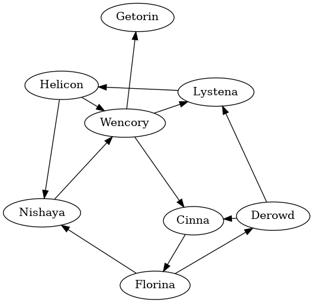
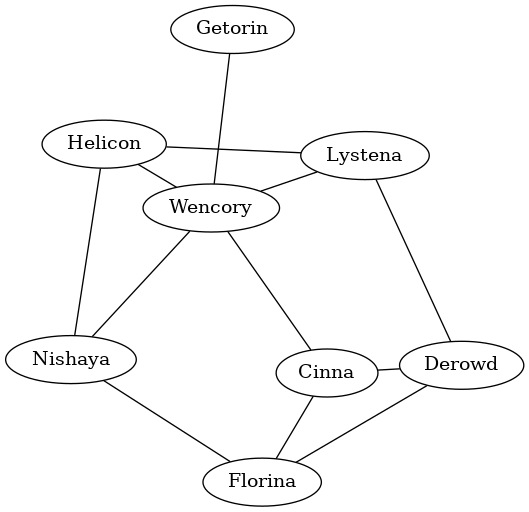
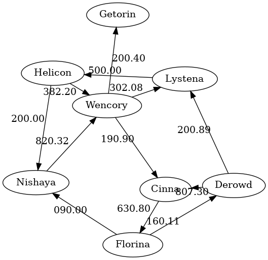
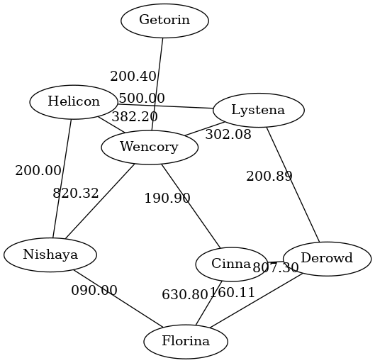

# Visualizing graphs

Graphite provides separate functions for visualizing undirected and directed
graphs: `plotUGraph` and `plotDGraph` respectively.

Lets define a directed graph:

```haskell
foundationUniverse :: DGraph String ()
foundationUniverse = fromArcsList
    [ "Helicon" --> "Nishaya"
    , "Helicon" --> "Wencory"
    , "Nishaya" --> "Wencory"
    , "Wencory" --> "Getorin"
    , "Wencory" --> "Cinna"
    , "Wencory" --> "Lystena"
    , "Lystena" --> "Helicon"
    , "Cinna"   --> "Florina"
    , "Florina" --> "Nishaya"
    , "Florina" --> "Derowd"
    , "Derowd"  --> "Cinna"
    , "Derowd"  --> "Lystena"
    ]
```

And visualize it with `plotDGraph`:

```haskell
main :: IO ()
main = plotDGraph foundationUniverse
```



We could now convert this graph to an undirected one using `toUndirected` and
then visualize it with `plotUGraph`:

```haskell
main :: IO ()
main = plotUGraph $ toUndirected foundationUniverse
```




## Visualizing edged graphs

When rendering the edge attributes is needed use the `plotUGraphEdged` and
`plotDGraphEdged` functions instead.

Lets define a directed graph with `Double` edge attributes as the distances
between planets in light years:

```haskell
foundationUniverse :: DGraph String Double
foundationUniverse = fromArcsList
    [ Arc "Helicon" "Nishaya" 200.00
    , Arc "Helicon" "Wencory" 382.20
    , Arc "Nishaya" "Wencory" 820.32
    , Arc "Wencory" "Getorin" 200.40
    , Arc "Wencory" "Cinna"   190.90
    , Arc "Wencory" "Lystena" 302.08
    , Arc "Lystena" "Helicon" 500.00
    , Arc "Cinna"   "Florina" 630.80
    , Arc "Florina" "Nishaya" 090.00
    , Arc "Florina" "Derowd"  160.11
    , Arc "Derowd"  "Cinna"   807.30
    , Arc "Derowd"  "Lystena" 200.89
    ]
```

And visualize it with `plotDGraphEdged`:

```haskell
main :: IO ()
main = plotDGraphEdged foundationUniverse
```



And again, we could now convert this graph to an undirected one using
`toUndirected` and then visualize it with `plotUGraphEdged`:

```haskell
main :: IO ()
main = plotUGraphEdged $ toUndirected foundationUniverse
```




## Plotting to PNG images

In order to output the graphs to PNG images, a new pair of functions are
available: `plotUGraphPng` and `plotDGraphPng`. These will take a file path for
the PNG output image as an additional parameter.

Lets use the first *foundationUniverse* graph to try them out:

```haskell
main :: IO ()
main = plotDGraphPng foundationUniverse "./foundation.png"
```

And convert it to undirected as well:

```haskell
main :: IO ()
main = plotUGraphPng (toUndirected foundationUniverse) "./foundation.png"
```
